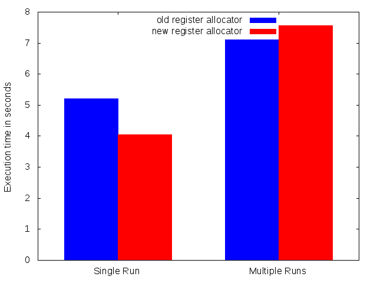

# GSoC 2018

This repository acts as the "Work Product Submission" for my [Google Summer of Code](https://summerofcode.withgoogle.com/) 2018 project.
[My project](https://summerofcode.withgoogle.com/projects/#4596557656096768) was implementing a register allocator for [libjit](https://www.gnu.org/software/libjit/). Register allocation is the process of determining which variables of a function reside in registers and which in memory. Often a non optimal, but fast allocation is preferred in JIT compilers as compilation time adds to execution time.

All my commits done during GSoC as well as the code changed can be [viewed here](https://github.com/M4GNV5/libjit/compare/pre-gsoc...M4GNV5:gsoc)

## Work summary
- Implement computation of the liveness sets `UEVar`, `VarKill` and `LiveOut`.
- Make function prologs and epilogs on x86-64 only store the base pointer when required and only move the stack pointer when required.
- Implement computing live ranges for each value using the computed liveness sets.
- Extend the the rules parser to include a section with register usage information for each instruction.
- Add internal live ranges when instructions use or clobber registers
- Implement a graph coloring based register allocator as described by Chaitin/Briggs:
	- Build the interference graph
	- Remove nodes from the graph and pushing them on a stack
	- Pop live ranges from the stack and color them.
	- If a live range was left uncoloured in the previous step spill it and restart the process.
- Add a flag to instructions which support a value to be in memory, so there is no need for creating a spill range for that value
- Add a diagnostic function which dumps all live ranges of a function
- Correctly move values into destination registers before instructions

## Comparasion

This repository contains various programs and a shell script for compiling them with and without the new register allocator. Their execution speed is then measured and visualized. All programs contain loops with configurable iteration count. There are two comparasions: `Single Run` runs the program one time with a high iteration count, this is good at showing the performance improvement by the new register allocator. `Multiple Runs` runs the program many times with a low iteration count, this is good at showing the compilation time penalty of the new register allocator.

#### Sum of numbers
This program sums all numbers from 0 to n

#### Constructed
This is a program specifically constructed perform better with a good register allocator.

