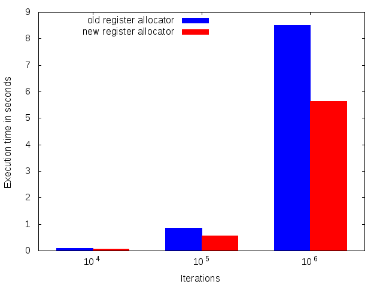
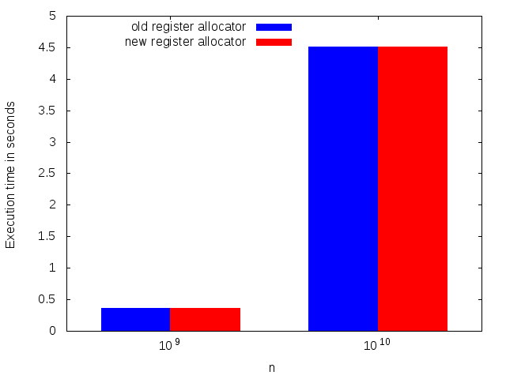
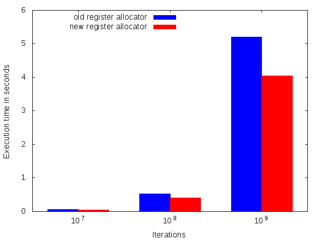

# GSoC 2018

This repository acts as the "Work Product Submission" for my [Google Summer of Code](https://summerofcode.withgoogle.com/) 2018 project.
[My project](https://summerofcode.withgoogle.com/projects/#4596557656096768) was implementing a register allocator for [libjit](https://www.gnu.org/software/libjit/). Register allocation is the process of determining which variables of a function reside in registers and which in memory. While working on my GSoC project I also wrote [a paper](https://i.m4gnus.de/registerallocation.pdf) which explains the theory behind writing a graph coloring based register allocator.

**All my commits done during GSoC as well as the code changed can be [viewed here](https://github.com/M4GNV5/libjit/compare/pre-gsoc...M4GNV5:gsoc)**

## Work summary
- Implement computation of the liveness sets `UEVar`, `VarKill` and `LiveOut`.
- Make function prologs and epilogs on x86-64 only store the base pointer when required and only move the stack pointer when required.
- Implement computing live ranges for each value using the computed liveness sets.
- Extend the the rules parser to include a section with register usage information for each instruction.
- Add internal live ranges when instructions use or clobber registers
- Implement a graph coloring based register allocator as described by Chaitin/Briggs:
	- Build the interference graph
	- Remove nodes from the graph and pushing them on a stack
	- Pop live ranges from the stack and color them.
	- If a live range was left uncoloured in the previous step spill it and restart the process.
- Add a flag to instructions which support a value to be in memory, so there is no need for creating a spill range for that value
- Add a diagnostic function which dumps all live ranges of a function
- Correctly move values into destination registers before instructions

#### Unimplemented
- The orginal Chaitin Briggs allocator has an additional step which coalesces live ranges. This is currently missing in libjit.
- In libjit there are special "manual" instructions which manually perform register operations. Currently only ARM has manual instructions. The new register allocator is untested with them.

## Comparasion
This repository contains various programs and scripts for comparing the the new and old register allocators. Their execution speed is then measured and visualized.

### Mandelbrot
The Mandelbrot fractal viewer is a good speed comparasion example, as it is a common program. The new allocator is approximately 35% faster.

### Sum of numbers
This program sums all numbers from 0 to n. The generated code looks nearly the same with both register allocators, so there is no real difference in execution speed.

### Constructed
This is a program constructed to perform better with a good register allocator. The code does not do anything useful, but contains many values and basic blocks.

